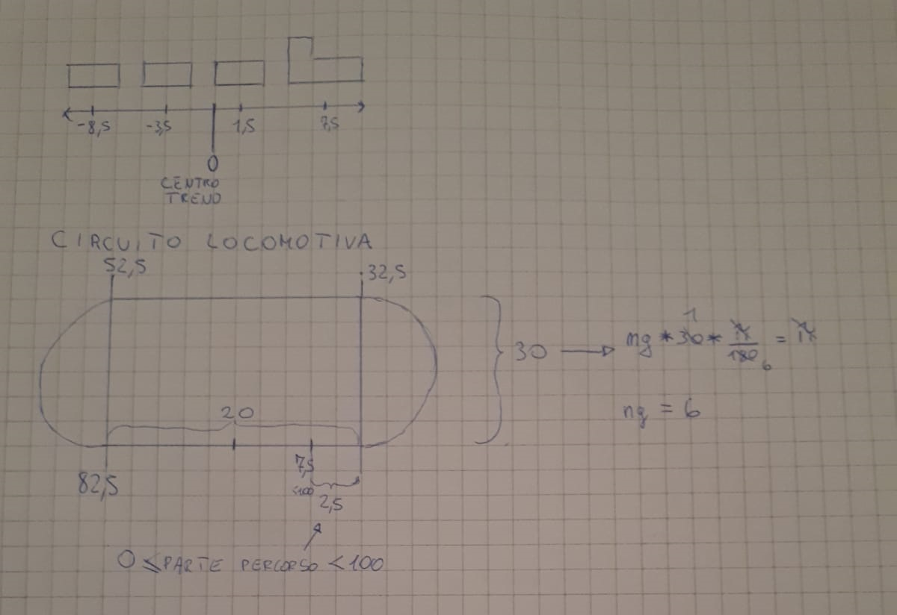
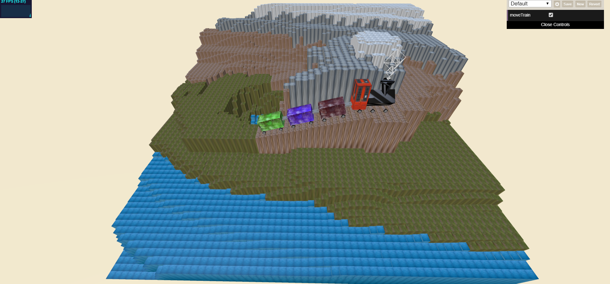
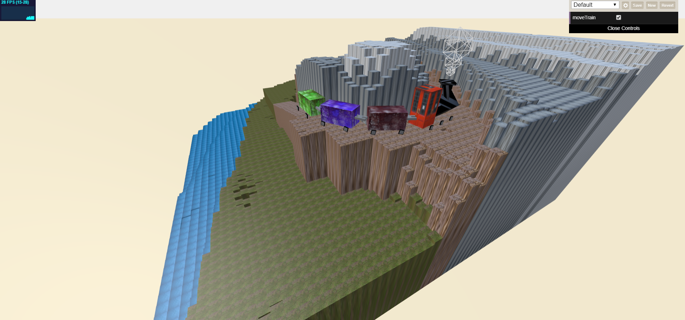

# Cube World - Tolusso Raffaele 138896 Anno accademico 2019/2020

## Descrizione

Il progetto consiste nel costruire una scena esclusivamente composta da cubi con una semplice animazione e la costruzione di un heightmap.
Tra le varie possibili scelta che mi sono venute in mente ho pensato di realizzare la scena di un trenino che si muove. In particolare il treno deve fare un percorso costituito da due rettilinei e due semicirconferenze e nel contempo sono animate le ruote e il fumo uscente dal camino della locomotiva. Nella seguente immagine è rappresentato un disegno del circuito e le relative misure riguardanti la locomotiva:  Ho utilizzato trasformazioni geometriche (compresa la scalatura) per costruire le varie parti del treno e le diverse forme. Per inserire l'heightmap ho costruito una funzione che inserisce tanti cubi quanti sono i pixel e ne scala l'altezza in base al colore contenuto nella mappa e assegna a ogni cubo una texture diversa a seconda dell'altezza. Un' altra alternativa era di inserire più cubi uno sopra l'altro in base all'altezza ma il costo computazione è più elevato in quanto inseriamo nella scena molti più oggetti. Le textures per i vari cubi sono state scaricate dal sito https://freestocktextures.com/.

## Risultato

La scena risultante è quella in figura:

