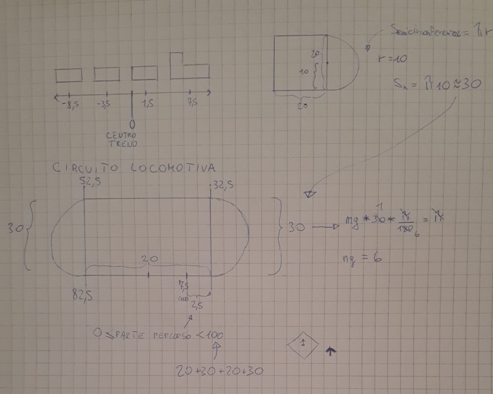
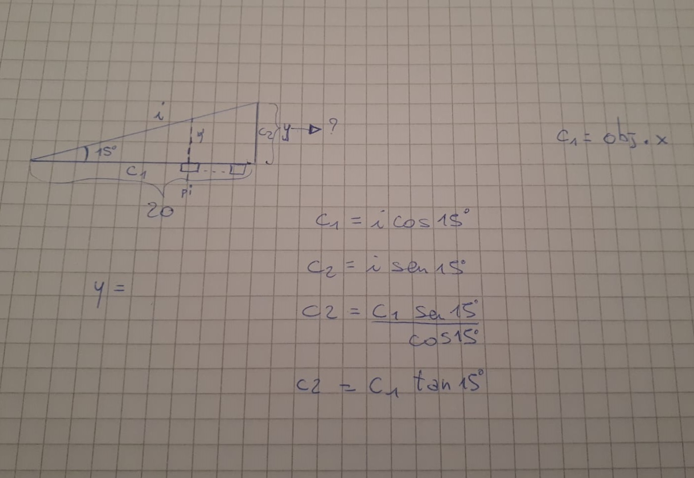

# Progetto Tolusso Raffaele 

L'idea è quella di una scena al cui interno si muove un treno a vapore fatto con i cubetti
il treno percorrà un circuito e una volta inserita l'heightmap cercherò di adattare i movimenti del treno a quest'ultima

## Costruzione treno 

Mi sono dedicato alla costruzione del treno e delle sue parti ho preso la decisione di avere un oggetto3d (Treno per l'appunto) in cui ho inserito le sue parti per la precisione 3 vagoni e una locomotiva.

- Ogni vagone è composto da un carico e dalle sue ruote che si muoveranno a coppia di due.
- La locomotiva è composta dalla cabina, dalla motrice e dal camino (anch'esso suddiviso in due parti).

## Problematiche di animazione del treno

Ho iniziato l'animazione del treno:

- ho costruito la semplice animazione delle ruote facendo ruotare l'oggetto 'setDiRuote" attorno al suo asse z senza riscontrare alcun problema.
- ho costruito la translazione del treno senza riscontrare alcun problema
- ho costruito una rotazione del treno rispetto a un pivot (altrimenti il treno avrebbe ovviamente ruotato su se stesso senza alcun senso), mi sono accorto che l' animazione di questo tipo non era una buona animazione perchè il treno era troppo lungo e ruotando aveva un effetto strano nei punti lontani dal baricentro.
Ho ripensato all'animazione e deciso di suddividere le varie parti del treno attribuendo ad ognuna di esse un un pivot in modo da farle ruotare in tempi diversi (prima la parte del treno più in avanti e poi le successiva mano a mano). A questo punto anche la translazione doveva essere ricostruita e attribuita ad ognuno dei pivot ( in modo che raggiungano tutti uno stesso punto attorno al quali copiere una rotazione). 

Sto lavorando su come basare il quando finire la translazione e far iniziare la rotazione e su come basare i parametri che le gestiscono.

Ho aggiunto una piccola rotazione ad ogni parte del treno nelle fasi di rotazione e scelto la maniera in cui il treno dovrà ruotare. A seconda della parte del percorso che deve essere percorsa basta dividere i valori ottenuti dal clock e usare il resto della divisione per rappresentare una parte del percorso. Il circuito di base è una traslazione seguita da una rotazione di 180° attorno a un centro seguita da un' altra traslazione nel verso inverso seguita ancora una volta da una rotazione di 180° che completi i 360° e riporti il treno al punto di partenza. Una volta costruito il plane seguendo l'heightmap cercherò di modificarlo ulteriormente in modo che segua la posizione dei cubi inseriti attraverso heightmap.

## Cambio direzione videocamera

siccome il circuito compiuto dal treno è ampio e la traslazione lunga ho deciso di translare il treno con un pivot in modo che il centro del circuito corrisponda al centro della scena e di posizionare la camera in alto in modo che veda l'intero moto del treno compiersi. Fatto ciò per permettere alla telecamera di guardare verso l'alto ho dovuto cambiare il suo up in (0,0,-1).

## Inserimento controlli movimento treno

Ho pensato di dare la possibilità di interagire con la scena scegliendo se il treno debba muoversi o meno. Ho riscontrato alcuni problemi nel controllare il treno continuando a usare il tempo come misura degli spostamenti. Se infatti si decidesse di far fermare il treno il tempo, ovviamente, continuerebbe a scorrere il porterebbe il treno a teletrsportarsi nel momento in cui lo si facesse ripartire. Per far sì che ciò non avvenga ho inserito una variabile che tenga conto del tempo in cui il treno rimane fermo e un'altra variabile che tenga conto dei ritardi.

(Il ritardo viene conservato nella variabile delay e il tempo di attesa incrementerà mentre la variabile gestita da GUI ha valore false)

Mi era venuta l'idea di permettere anche di scegliere la velocità con cui il treno avrebbe dovuto viaggiare, ma incrociando le due cose (l'attesa e l'incremento di velocità) il codice diventerebbe molto più complesso da gestire se si volesse continuare ad utilizzare il tempo per controllare la posizione del treno.

## Utilizzo HeightMap

Ho costruito la funzione Field() che costruisce il terreno partendo dall'heightmap. Ho inoltre inserito le texture nel progetto e le luce prendendo il codice dall'esempio del Starting Code. Una volta caricata l'heightmap mi sono accorto che era necessario ridimensionare le proporzioni del circuito dato che heightmap con grandi dimensioni causavano un crollo delle prestazioni. Una volta ridimensionato è riapparso il problema dello slittamento del treno e sono stato costretto a reintrodurre le singole animazioni dei vagoni per rimediare. Ora il circuito e le animazioni del treno sono completate tranne che per le operazioni sull'asse Y.

### Ritocchi

Ho sistemato l' Heightmap in modo che rappresenti il circuito e aggiunto l'animazione di salita calcolando la posizione Y con un po di trigonometria. 

Ho modificato molti materiali e aggiunto le textures a quasi tutte le parti del treno e aggiunto il vapore alla locomotiva che rimane animato anche per un po' dopo che la locomotiva si ferma. Ho reimpostato l'up della camera a quello di default dato che l'Heightmap suggerisce anche una vista verso -Z (le montagne sono in quella direzione). Migliorato il metodo di caricamento delle texture per i cubi del terreno in modo da non generare 1 materiale per cubo e migliorare le prestazioni.

